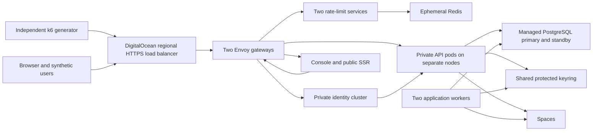

# DigitalOcean test deployment and production reference

Status: proposed target; [private compatibility bootstrap](../deploy/digitalocean/README.md) implemented and locally checked. No cloud resources provisioned.
Owner: platform maintainers. Updated: 2026-09-07.
Parent: [repository overview](../README.md). Evidence motivating this plan:
[performance assessment](performance-and-scalability-assessment.md).

## Purpose and agreed boundaries

Create a disposable test campaign from the same deployment definitions we intend
forks to use in production. DigitalOcean Kubernetes (DOKS) and managed PostgreSQL
are the provisional reference target. Tests determine whether to retain that target
and what resources it needs; choosing Kubernetes does not establish scalability.

A campaign includes provisioning, deployment, correctness checks, data seeding,
capacity and failure measurements, evidence export, and verified destruction.
Only synthetic customer data and dedicated provider test accounts are used.
Production-mode boot guards, authorization, RLS, auditing, durable messaging,
TLS and gateway fairness remain enabled. DigitalOcean configuration stays in an
optional deployment directory; domain code remains provider-independent.

This document is a plan, not evidence that cloud tests passed. No cloud resources
or accounts have been created and no spending commitment has been made.

## Proposed target and failure contract

Start with one region and VPC. NYC3 is a candidate, subject to an account-level
availability check for the selected node plans, PostgreSQL, Spaces and Standard
NFS. Do not silently substitute shared CPUs or another region. Pin supported
Kubernetes and PostgreSQL versions and immutable application image digests for
each campaign. Start PostgreSQL at version 17 to match the local major version.

The proposed minimum resilience topology is three API nodes, three support nodes,
two gateways, two application workers, and a managed database primary plus one
same-size standby. A single API node loss leaves two serving API replicas. This
is a candidate production minimum, not a claim that those survivors can already
serve 1000/sec. A region outage and simultaneous independent failures are outside
this first contract.

| Failure | Required observation and proposed gate |
|---|---|
| One API pod/node | Healthy survivors continue; within 60 seconds, restore the tested steady throughput/error/latency gates at the same offered rate. At 1000/sec, the two survivors each need roughly 500/sec capacity. Record the entire transition separately. |
| One gateway/support node | A gateway remains available; validate new and reused connections, draining, source identity and rediscovery. Verify replacement pods fit on surviving support nodes. |
| One application worker | Accepted durable work completes through the survivor; no duplicate business effects or unexplained dead letters; report backlog age and final drain. |
| PostgreSQL primary | Exercise the provider-supported failover; target recovery within 120 seconds, record failed/uncertain requests and reconcile acknowledged writes. Any observed lost acknowledged write fails the campaign. This does not establish a contractual zero RPO; verify provider guarantees before promising one. |
| Limiter service | Two stateless replicas share the same counters; verify routing and policy consistency during one replica loss. |
| Redis | A single ephemeral Redis intentionally remains: loss degrades fleet fairness until recovery, while bounded local protection stays active. Verify alerting and restored enforcement; restart renews allowances. This is not highly available fairness. |
| Shared key storage/provider outage | Existing and new sessions, key refresh, new pods and credential operations must be exercised. Report the affected operations; do not infer resilience from a healthy API probe. |

The 60/120-second recovery targets are proposed starting acceptance budgets, not
provider guarantees. Failover transitions do not disappear from the report merely
because steady-state tests pass. At least one 1000/sec representative workload
must pass normally and after the selected node-loss case before advertising that
capacity. If three APIs cannot provide that headroom, increase measured resources
or revise the supported capacity; do not relax the test to obtain a green result.

## Resource and scheduling plan

| Resource | Capacity configuration | Resilience configuration |
|---|---|---|
| API nodes | 1, then 2, then 4 dedicated-CPU nodes; 4 vCPU / 8 GiB each | 3 same-size nodes; add a fourth temporarily for deployment surge |
| API pods | One per node; initially CPU request/limit 2, memory request/limit 3 GiB | Same per-pod allocation; required hostname anti-affinity; minimum two available during voluntary disruption |
| Support nodes | 3 dedicated-CPU nodes, 4 vCPU / 8 GiB each, fixed across the matrix | Same pool, with surviving-node scheduling checked |
| Gateways | 2 Envoy pods on different support nodes | Same; each must carry the full tested ingress rate on loss of its peer |
| Workers | 1 for attributable read matrix; 2 for background-work matrix | 2 on different support nodes |
| Fairness | 2 standard rate-limit service pods, 1 ephemeral Redis | Same; deliberately retain ADR 54 outage semantics |
| Frontends/scanner | Separate console static-server and public SSR workloads; production ClamAV adapter | 2 frontend replicas and 2 scanners spread across support nodes; verify service discovery and scan recovery |
| Database | Dedicated general-purpose 4 vCPU / 16 GiB, 70 GiB storage, primary + 1 standby | Same; keep HA replication overhead in the capacity evidence |
| Generator | Separate 4 vCPU / 8 GiB dedicated-CPU Droplet, outside DOKS | Same; its failure invalidates the run rather than measuring application failover |
| Keyring | Managed Standard NFS, smallest 50 GiB share, private shared path | Same; verify mount permissions, encryption protection and key rotation |
| Objects | Spaces through the existing S3 adapter | Same; separate disposable business-data bucket from retained evidence |
| Control plane | DOKS HA enabled | Same |

Node size leaves room beyond the API allocation for Kubernetes and OS work.
Record CPU throttling: a pod CPU limit is part of the tested configuration, not
an invisible implementation detail. Taint/select pools so application workers,
scanners and frontends cannot consume the API nodes' remaining capacity.

Support pod requests/limits must be filled in from a deployment smoke measurement
before qualification. Require the remaining two support nodes to fit all critical
work after one loss, including rollout surge and system reservations. Memory-hungry
ClamAV signature updates need explicit room. Do not let a pending replacement
pod silently turn the failure test into an easier workload. Keep metrics collection
bounded and export to an off-cluster destination; do not run a large observability
stack on the generator or API nodes.

Autoscaling is disabled for fixed-capacity and initial failure tests. Node count,
pod count, database resources, worker count, audit policy and route mix are all
recorded independently. Test autoscaling in a separate campaign phase afterward.
Required one-API-per-node anti-affinity plus `maxSurge: 1` needs a spare API node:
provision it before a rolling update and remove it after drain. A disruption budget
covers voluntary eviction; it cannot prevent a node failure.

## Traffic and trust boundaries

Use an explicitly selected **regional HTTP load balancer**, with HTTPS termination,
HTTP backend traffic inside the trusted VPC, and PROXY protocol to Envoy. Enable
Envoy's PROXY-protocol listener support and accept that ingress only from the
load balancer. Do not expose a second backend route that accepts forged PROXY
metadata. Redirect HTTP to HTTPS; reject unexpected Host values. Preserve the
actual tenant Host and set the application scheme from trusted deployment context.

This requires a cloud overlay: the current Docker listener cannot parse PROXY
protocol and explicitly sets forwarded scheme to HTTP. DigitalOcean documents
that `externalTrafficPolicy: Local` alone does not preserve source IP for its HTTP
load balancer. Keep the existing internal header stripping and private identity
namespace denial. Exercise forged X-Forwarded-For/Host, PROXY bypass, cookies,
redirects and Secure cookie attributes before load. See the
[DigitalOcean load-balancer settings](https://docs.digitalocean.com/products/kubernetes/how-to/configure-load-balancers/).

Use a headless API Service so Envoy resolves individual pod endpoints, retaining
separate identity and business clusters. Verify readiness removal and DNS refresh
on scale, restart and node loss. [Kubernetes headless Services](https://kubernetes.io/docs/concepts/services-networking/service/#headless-services)
provide endpoint DNS rather than a single virtual service IP.

SSR-originated requests need a separate internal gateway listener reachable only
by SSR pods. It preserves the tenant Host and original credentials. It must use
an explicitly documented SSR-egress allowance and cannot be a public bypass.
Anonymous per-browser IP protection belongs at the outer ingress; never trust a
client-provided IP header merely to avoid grouping SSR calls. Browser page views
and internal API calls are counted separately, with both limiter policies retained.

## Database and state compatibility gate

Run the real migrate image as a one-off Job using the database administrative
identity. API/worker secrets contain only the runtime role. The current
[MigrationRunner](../src/Premise.Api/MigrationRunner.cs) creates/alters `app_user`
and grants schema/data permissions; verify those operations using the provider's
restricted administrative role. Never solve a migration failure by giving the
API administrative credentials. Exercise `ltree`, PostGIS, forced RLS, spatial
queries, module migrations, clean re-provision and binary upgrade. Verify access
to `pg_stat_statements` and the available provider query/wait telemetry; managed
service permissions may differ from the local database owner. Supported
extensions are documented by [DigitalOcean](https://docs.digitalocean.com/products/databases/postgresql/details/supported-extensions/);
that list alone is not a migration test.

Start with bounded direct TLS connections to isolate provider compatibility.
Then qualify the production transaction-pooling path as a separate comparison:
EF/application queries use managed PgBouncer, Wolverine messaging uses direct
connections as required by ADR 53, migrations remain direct. Verify automatic
prepared statements against the actual managed pooler configuration before
turning them on. Keep the chosen connection path the same in the final soak and
resilience tests. [DigitalOcean connection pools](https://docs.digitalocean.com/products/databases/postgresql/how-to/manage-connection-pools/).

A 16 GiB plan currently lists 397 available backend connections. Reserve at least
50 for operations and count every distinct pool across APIs, workers, migrations,
observers and rollout surge. Example: 4 APIs + 2 workers with one 20-slot primary
and one 10-slot messaging pool each account for 180, not 20. This is illustrative:
inspect actual pool multiplicity before accepting the budget. For pooled operation,
count PgBouncer server connections plus every bypass connection, not its client
limit. [Provider limits](https://docs.digitalocean.com/products/databases/postgresql/details/limits/).

The existing authentication configuration writes Data Protection XML keys to a
shared filesystem. Standard NFS reuses that path without a new application storage
adapter; a per-node volume or read-only Kubernetes Secret is not an equivalent
rotating shared store. Restrict the share to the app VPC and relevant pods, and
add explicit key-at-rest protection using the framework's certificate protection
before target qualification. Share the certificate through a protected Kubernetes
Secret and test old-key decryption during rotation. The existing business-secret
KMS adapter does **not** automatically encrypt Data Protection XML. Verify NFS
availability and mount behavior before committing to the region. [NFS features](https://docs.digitalocean.com/products/nfs/details/features/).

## Production providers and bootstrap

| Dependency | Proposed campaign arrangement | Work remaining |
|---|---|---|
| Auth | WorkOS test environment using the real adapter | Configure callback/domain URLs; dedicated synthetic test users; real login, org switch, contact and revocation checks |
| Billing | Stripe test mode | Test prices/webhooks and plans; no live charges |
| Email | SMTP provider sandbox or restricted recipient delivery | Verify contact-link delivery to owned test mailboxes |
| Objects | Spaces endpoint with existing S3 adapter | Presigned upload/download, CORS, quarantine/scanner flow, expiry and deletion smoke |
| Business-secret wrapping | Existing AWS KMS adapter, pending maintainer choice | Restricted campaign key/identity, AWS region/credentials, real wrap/unwrap and rotation; no LocalStack in target qualification |
| Data Protection | Shared NFS keyring plus certificate protection | Small framework configuration addition, shared-certificate rotation and cross-node session tests |
| Images | Existing private OCI registry if available | Build linux/amd64 images for .NET, SSR and static console; record digests and pull access |
| Initial operator/data | Production-compatible bootstrap Job/tool | Current fleet preparer uses local dev sign-in and is not a hosted seed tool; create dedicated users/tenant through supported flows, then issue test keys and seed through authenticated APIs |

DigitalOcean plus managed PostgreSQL does not by itself satisfy the repo's
production boot guards. Keep them on. AWS KMS is an external provider choice,
not a hidden assumption; a DigitalOcean-only requirement would require choosing
and implementing another `IKeyWrapper` adapter. Provider test mode changes
credentials and accounts, not the application's authorization or storage behavior.

## Estimated campaign cost

USD public list prices checked 2026-09-07; availability, tax, provider accounts,
transfer overages and exact billing must be checked again before applying.
These are estimates, not authorization to provision. PostgreSQL pricing was read
from the interactive **General Purpose** selector, with **one additional node**;
it must not be confused with the cheaper default shared-CPU table.

| Item | Unit estimate | Quantity / cost |
|---|---:|---:|
| Dedicated 4 vCPU / 8 GiB CPU-optimized node | $0.125/hour, $84/month cap | Capacity: 1/2/4 API + 3 support + 1 generator = 5/6/8 units |
| PostgreSQL GP 4 vCPU / 16 GiB / 70 GiB | $0.33787/hour per node | Primary + standby: $0.67574/hour, $454.10/month |
| DOKS HA control plane | $40/month | Allow approximately $0.06/hour in short-run planning |
| Regional HTTP load balancer, one unit | Starts at $12/month | Allow approximately $0.018/hour; verify TLS connection churn separately from HTTP request rate |
| Standard NFS, 50 GiB | $0.15/GiB/month | $7.50/month allocation; include the full amount conservatively in the campaign allowance |
| Spaces base subscription | $5/month | Shared across buckets; retained evidence can keep the subscription active after cluster teardown |

Sources: [Droplets](https://www.digitalocean.com/pricing/droplets),
[database calculator](https://www.digitalocean.com/pricing/managed-databases),
[DOKS](https://www.digitalocean.com/pricing/kubernetes),
[load balancer](https://www.digitalocean.com/pricing/load-balancers),
[NFS](https://docs.digitalocean.com/products/nfs/details/pricing/),
[Spaces](https://docs.digitalocean.com/products/spaces/details/pricing/).

Using those rounded hourly allowances, compute/database/ingress cost is about
**$1.38 / $1.50 / $1.75 per hour** for the 1/2/4-API capacity configurations.
The three-API resilience baseline is about **$1.63/hour**, or $1.75/hour during
one-node deployment surge. Eight hours at the largest configuration is about
$14; 24 hours about $42, before storage allowances and external-provider charges.
A **$75 planning envelope for a 24-hour campaign** leaves room for the $12.50
storage allowance and some retries; it is not a hard spending cap or a complete
quote for paid identity/email/KMS/registry plans. Validate those separately.

Provisioning, seeding, warmup, repairs and retained resources are billable time.
Use a campaign expiry timestamp and CI timeout, plus an independent cleanup job
that survives runner failure. A billing alert alone is not a spend limit.

## Implementation sequence and acceptance

Use one small Terraform root for DigitalOcean resources and native Kubernetes
manifests with a Kustomize overlay for the cloud. Keep secrets/state outside Git;
use an existing protected remote state backend with locking. Do not create a
custom deployment framework, service mesh or GitOps controller for this campaign.
The [small compatibility implementation](../deploy/digitalocean/README.md) now contains
a pinned Terraform root and private application manifest renderer. The remaining
cloud gateway, provider setup, hosted fixtures and campaign automation are not yet implemented.

| Slice | Deliverable | Exit evidence |
|---|---|---|
| 1. Compatibility bootstrap | VPC, minimal DOKS, managed database, keyring, provider configuration, migration and production API smoke | Real migrations and runtime RLS pass; cross-node cookie survives restart; scanner/storage/provider smoke; owned-resource inventory and destroy rehearsal |
| 2. Target deployment | Cloud Envoy overlay, private/headless Services, frontends, workers, budgets, health and shutdown settings | Ported gateway contract tests plus TLS/IP/SSR checks; enough room for a support-node loss and API surge |
| 3. Remote harness | Independent generator setup, hosted fixture preparation, telemetry/export and campaign runner | Negative controls fail on dropped arrivals, invalid bodies, errors, imbalance and fail-open; results survive generator/cluster teardown |
| 4. Capacity matrix | Small and representative data; 1/2/4 API nodes; key/cookie/public mixes; fixed workers/DB | Repeat passing and failing steps three times; unchanged p95/p99 and error budgets; per-minute balance and resource attribution |
| 5. Soak and resilience | Four-hour steady run with background writes/imports, then separately labeled failure windows | No unresolved correctness/loss; bounded memory/pools/backlog; proposed recovery gates assessed; reconcile every accepted durable operation |
| 6. Target decision | Evidence-backed sizing, HA and cost recommendation | Maintainer can accept/reject DigitalOcean target without relying on local laptop results; teardown inventory shows no unintended retained resources |

Run the first compatibility slice small; only allocate the full matrix once it
passes. This is staged spending, not permission to omit dependencies from the
final production-equivalent qualification.

## Lifecycle, evidence and destruction

Every resource has a campaign ID, owner, expiry and recorded provider resource ID.
Separate reusable foundations (DNS zone, registry, state backend, retained evidence,
provider test accounts) from campaign-owned infrastructure and data. Reusable
resources are never included in blanket destruction. The evidence destination
must exist outside the campaign's destroy state.

1. Validate selected region/plans, credentials, DNS ownership, budget and expiry.
2. Plan/apply infrastructure; deploy migration Job, then workloads; wait for real
   readiness and full identity/limiter decisions, not only a TCP health response.
3. Seed dedicated data and run correctness controls. Save native traffic policy.
   Benchmark exceptions identify exact tenants/egress identities and expire with
   the campaign; ordinary noisy-neighbor controls run with normal limits.
4. Warm up, measure, exercise failures and drain. Save revision/digests, resource
   allocations, versions, provider settings, workload seeds, raw samples, per-minute
   distributions, counter deltas, SQL plans/waits and complete pass/fail verdicts.
5. Export and verify a checksummed evidence inventory. Exclude credentials,
   authentication cookies, private key material and unredacted dumps. If export
   fails, mark the run incomplete and attempt a small diagnostic export; do not
   leave the environment running indefinitely waiting for a large upload.
6. Remove Kubernetes LoadBalancer Services and PVCs while the controller still
   runs; wait for their cloud resources to disappear. Destroy the cluster,
   generator, database/standby, campaign NFS/snapshots, business-data buckets,
   temporary DNS/certificates and campaign credentials using recorded IDs.
7. Reconcile provider inventory against the manifest after normal destruction
   and after interrupted provisioning. Report every retained resource, its owner,
   reason and ongoing cost. Keep protected state until reconciliation completes.

A pipeline `finally` step is useful but insufficient when the runner dies. The
independent expiry cleanup needs campaign-scoped credentials and ID checks; a tag
alone does not authorize deleting an unrelated resource. AWS KMS keys have their
own deletion/retention rules and retained encrypted evidence must remain readable;
resolve that lifecycle as part of the provider choice, not during emergency cleanup.

## Inputs before provisioning

- Maintainer decision: AWS KMS alongside DigitalOcean, or select another real
  key-management provider. Question raised; no answer recorded yet.
- DigitalOcean account/project access and verified region/node/database availability.
- Owned test DNS subdomain and TLS certificate method; provider test accounts and
  registry/state/evidence destinations, supplied through protected configuration.
- Final campaign spending ceiling and execution window after account-specific
  quote; proposed starting envelope above is $75 for 24 hours excluding unknown
  third-party subscription costs.

These inputs do not prevent writing the deployment design or independent manifest
work. They do prevent calling the environment production-equivalent or launching
paid infrastructure with unspecified identity, keys and cost.

Related: [production configuration](production.md), [gateway contract](gateway-fairness.md),
[external test procedure](capacity-validation.md#external-qualification-handoff),
[performance assessment](performance-and-scalability-assessment.md), [README](../README.md).
